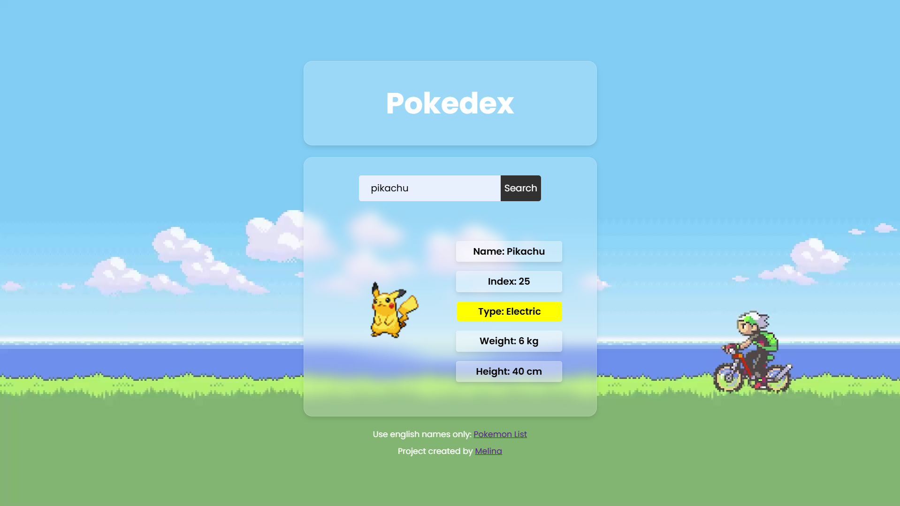

# Pokédex: Interaktive Pokémon-Datenbank 🎮


Pokédex ist eine einfache, aber leistungsstarke Webanwendung, mit der Benutzer Pokémon suchen und wichtige Informationen zu jedem Pokémon erhalten können. Die Anwendung nutzt die PokéAPI, um Echtzeitdaten abzurufen und sie in einer benutzerfreundlichen Oberfläche anzuzeigen.

## Features

- **Pokémon-Suche:** Benutzer können Pokémon anhand ihres Namens suchen.
- **Echtzeit-Daten:** Die App lädt Typ, Gewicht, Größe und Index aus der PokéAPI.
- **Farbliche Typ-Kennzeichnung:** Typen werden optisch hervorgehoben.
- **Benutzerfreundlich:** Intuitive Bedienung und modernes Design.

---

## Projektstruktur

- **Frontend:** 
  - Reines HTML, CSS und JavaScript.
  - Dynamische DOM-Manipulation zur Darstellung der Daten.
- **API:** 
  - Integration der [PokéAPI](https://pokeapi.co/), einer offenen API für Pokémon-Daten.

---

## Technologien

- 🖼️ **Frontend:** HTML, CSS und JavaScript.
- 🌐 **API:** PokéAPI zur dynamischen Datenabfrage.

---

## Software-Entwicklung und Planung

Dieses Projekt wurde eigenständig entworfen und umgesetzt, mit Fokus auf:
- **API-Integration:** Abruf und Verarbeitung von Echtzeitdaten.
- **Modularer Code:** Funktionen wie `addClass` und `firstLetterCapital` für Wiederverwendbarkeit.
- **Design:** Ein moderner, minimalistischer Look mit nostalgischem Pixel-Art-Stil.

---

### Screenshots

1. **Startseite:** Eingabemaske für die Pokémon-Suche.  
   

2. **Pokémon-Daten:** Details wie Name, Typ, Größe und Gewicht werden dynamisch geladen.  
   

---

## Voraussetzungen

Um dieses Projekt lokal auszuführen, benötigen Sie:

1. [Node.js](https://nodejs.org/).
2. Einen modernen Browser (z. B. Chrome, Edge oder Firefox).

---

## Lokale Installation und Ausführung

1. **Projekt klonen:**
   ```bash
   git clone https://github.com/dein-benutzername/pokedex.git
   cd pokedex
    ```
---

## Öffnen von `index.html`

- Öffnen Sie die Datei direkt in Ihrem Browser oder via Live-Server unter:  
  `http://localhost:8080`.

---

## Nutzung

1. Geben Sie den Namen eines Pokémon ein (z. B. "pikachu") und klicken Sie auf **"Search"**.
2. Die App zeigt die wichtigsten Informationen wie Typ, Index, Größe und Gewicht des Pokémon an.
3. Die Typen werden farblich hervorgehoben, um die Zuordnung zu erleichtern.

---

## Lizenz

Dieses Projekt steht unter der [MIT-Lizenz](LICENSE).

---

## Kontakt

Für Fragen oder Feedback kontaktieren Sie mich über [E-Mail](mailto:melinakiefer@hotmail.de) oder GitHub. Ich freue mich auf Ihre Rückmeldung!
